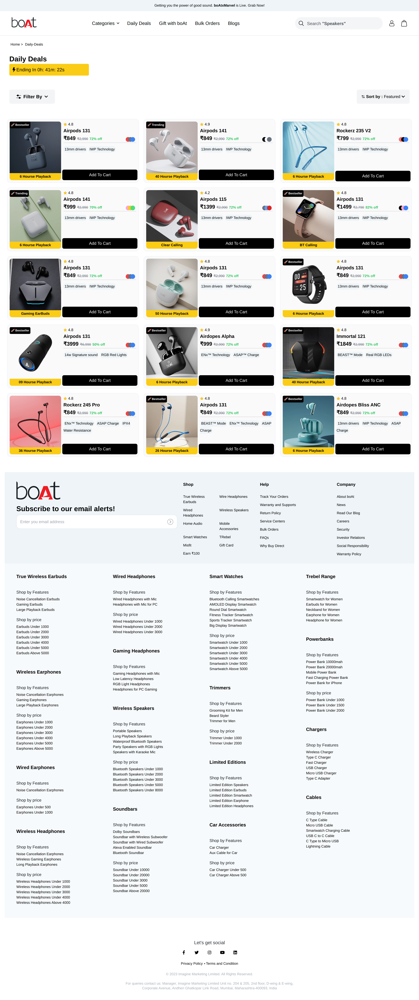

# boAt Lifestyle Clone

## [Hosted Link](https://nirzon47-boat.netlify.app/)

### Table of Contents

The screenshots take a lot of space. Click on the links to navigate easily

- [boAt Lifestyle Clone](#boat-lifestyle-clone)
  - [Hosted Link](#hosted-link)
    - [Table of Contents](#table-of-contents)
    - [Features](#features)
    - [Screenshots](#screenshots)
    - [Tools used to build the project](#tools-used-to-build-the-project)
    - [Tailwind Custom Plugins](#tailwind-custom-plugins)
    - [Building / package.json scripts](#building--packagejson-scripts)
    - [Contributors](#contributors)
    - [Challenges Faced](#challenges-faced)

### Features

- Fully responsive
- Hard to distinguish from the real webpage
- High quality carousels
- Auto-playing videos to catch attention even in desktop version
- Interactive footer and menu buttons
- Made with TailwindCSS
- Extra touches to give more life to the webpages compared to the original
- Proper semantic tags used for accessibility

### Screenshots

`index.html`
Desktop:

Mobile:

Out of consideration of user experience reading the readme file, the other mobile UI screenshots are exempted, please visit the webpage.
They are responsive.

`deals.html`

`gift.html`

`blogs.html`

``

### Tools used to build the project

| Tool           | Purpose                                                            | Link                                        |
| -------------- | ------------------------------------------------------------------ | ------------------------------------------- |
| HTML           | Markup language                                                    | —                                           |
| CSS            | Scripting language for styling webpages                            | —                                           |
| TailwindCSS    | CSS Framework                                                      | [Link](https://tailwindcss.com/)            |
| slick carousel | For carousel                                                       | [Link](https://kenwheeler.github.io/slick/) |
| jQuery         | For slick to function properly and for some click and hover events | [Link](https://jquery.com/)                 |
| JavaScript     | Logic for the webpage in some elements                             | —                                           |
| FontAwesome    | Adds custom icons                                                  | [Link](https://fontawesome.com/)            |

### Tailwind Custom Plugins

`input.css`: Extra base layers to make a font family from external font files for easy use

`tailwind.config.js`: Custom colors, media breakpoints, line heights, search bar background

### Building / package.json scripts

After cloning the files into your local machine, run

`npm install`

to install the dev dependencies

`npm run buildcss`

which is defined in `package.json` to run

`npx tailwindcss -i input.css -o style.css --watch`

And you should be good to go to edit the files using your own tailwindcss.

To make the CSS file as small and efficient as possible, a script for that is also present for production.

`npm run minify`

which is defined in the `package,json` to run

`npx tailwindcss -o style.css --minify`

### Contributors

- Nirzon Taru Karmakar
- Saiful Islam
- Juber
- Saurabh Shrikhande

### Challenges Faced

- Merge Conflicts
- Advanced git concepts
- Proper way of doing simulating on click events using jQuery
- Implementing carousel
- Collapsible footer elements
- Extra effects like scaling and transitions in TailwindCSS
- TailwindCSS CLI use for optimized production
- Collaboration using Git

---

Nirzon Taru Karmakar or any of the other members working on the project are not affiliated with boAt Lifestyle.

All images, fonts are trademarks and copyrights of boAt Lifestyle and they are not used for commercial use.
